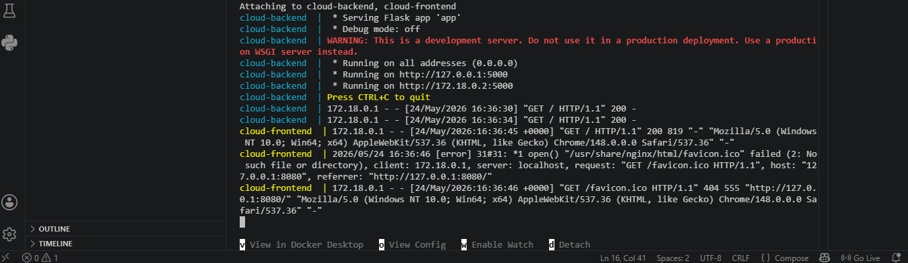
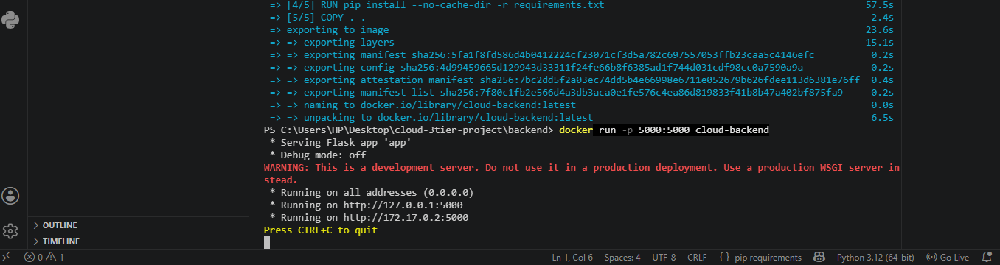
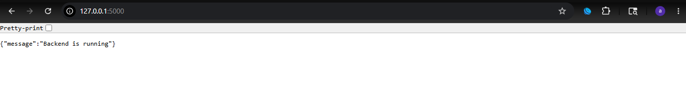
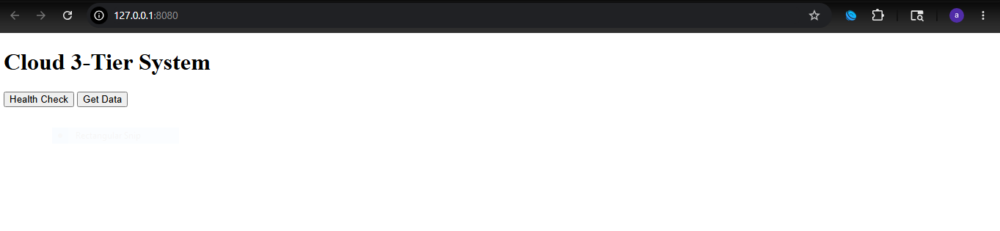
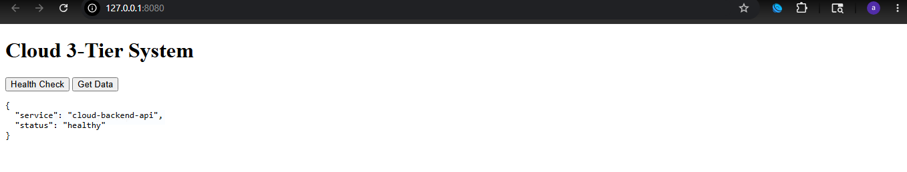
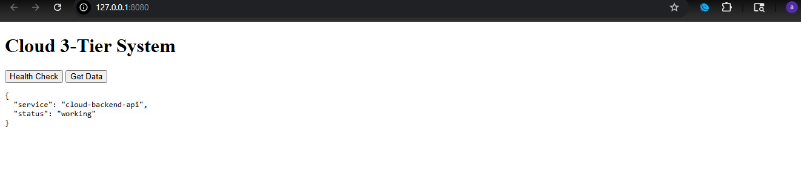
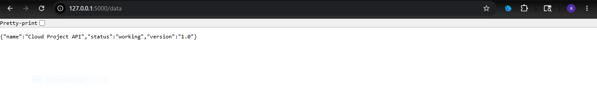

✦ ━━━━ ⟡ CLOUD 3-TIER DOCKERIZED APPLICATION ⟡ ━━━━ ✦

═══════════════════════════════════════════════════════════════════════


━━━━━━━━━━━━━━━━━━━━━━━━━━━━━━━━━━━━━━━━━━━━━━━━━━━━━━━━━━━━━━━
## ✦ PROJECT OVERVIEW ✦
━━━━━━━━━━━━━━━━━━━━━━━━━━━━━━━━━━━━━━━━━━━━━━━━━━━━━━━━━━━━━━━

This project is a fully containerized cloud-native **3-tier application** developed using modern **DevOps**, **Cloud Computing**, and **Microservices Architecture** principles.

The application simulates a real-world production environment where multiple services run independently inside Docker containers and communicate through REST APIs over a Docker network.

The project demonstrates how modern cloud applications are:

- Designed
- Structured
- Containerized
- Deployed
- Managed
- Connected through service-based architecture

This project focuses on creating a scalable and production-like deployment environment using:

- Frontend Layer
- Backend Layer
- Docker Infrastructure Layer

The frontend and backend are isolated into separate containers and communicate through APIs exactly like modern cloud-native applications used in enterprise environments.


━━━━━━━━━━━━━━━━━━━━━━━━━━━━━━━━━━━━━━━━━━━━━━━━━━━━━━━━━━━━━━━
## ✦ TABLE OF CONTENTS ✦
━━━━━━━━━━━━━━━━━━━━━━━━━━━━━━━━━━━━━━━━━━━━━━━━━━━━━━━━━━━━━━━

1. Introduction  
2. Project Overview  
3. Project Screenshots  
4. Objectives of the Project  
5. Technologies Used  
6. Features of the Application  
7. Why This Project Was Built  
8. System Architecture  
9. Architecture Explanation  
10. Project Workflow  
11. Frontend Explanation  
12. Backend Explanation  
13. Docker Explanation  
14. Docker Compose Explanation  
15. REST API Communication  
16. Docker Networking  
17. Folder Structure  
18. Installation & Setup  
19. Docker Deployment Process  
20. Running the Application  
21. API Endpoints  
22. API Testing  
23. Challenges Faced  
24. Troubleshooting  
25. Key Learnings  
26. Real-World Use Cases  
27. Security Considerations  
28. Scalability Discussion  
29. Future Improvements  
30. Resume Description  
31. Conclusion  


━━━━━━━━━━━━━━━━━━━━━━━━━━━━━━━━━━━━━━━━━━━━━━━━━━━━━━━━━━━━━━━
## ✦ 1. INTRODUCTION ✦
━━━━━━━━━━━━━━━━━━━━━━━━━━━━━━━━━━━━━━━━━━━━━━━━━━━━━━━━━━━━━━━

Modern applications are no longer built as large monolithic systems. Today, most enterprise applications follow a **microservices-based cloud-native architecture** where services are divided into independent components.

This project demonstrates a simplified but practical implementation of a modern cloud application using:

- Docker
- Flask APIs
- Nginx
- Docker Compose
- REST Communication
- Multi-container Deployment

The application architecture follows a **3-tier deployment model** commonly used in:

- Enterprise Applications
- SaaS Platforms
- E-Commerce Systems
- Banking Applications
- Cloud Platforms
- Production DevOps Environments

The project gives practical understanding of:

- Containerization
- API Communication
- Service Isolation
- Cloud Deployment Workflow
- Docker Networking
- Multi-container Management


━━━━━━━━━━━━━━━━━━━━━━━━━━━━━━━━━━━━━━━━━━━━━━━━━━━━━━━━━━━━━━━
## ✦ 2. PROJECT OVERVIEW ✦
━━━━━━━━━━━━━━━━━━━━━━━━━━━━━━━━━━━━━━━━━━━━━━━━━━━━━━━━━━━━━━━

This application consists of three major layers.


### ◇ Frontend Service

The frontend is built using:

- HTML
- CSS
- JavaScript

The frontend is hosted using:

- Nginx Web Server

Responsibilities of frontend:

- User Interface
- API Calls
- Dynamic Data Display
- User Interaction


### ◇ Backend Service

The backend is built using:

- Python
- Flask Framework

Responsibilities of backend:

- REST API Development
- Request Processing
- JSON Response Handling
- Health Monitoring


### ◇ Infrastructure Layer

The infrastructure layer consists of:

- Docker Containers
- Docker Networking
- Docker Compose

Responsibilities:

- Container Management
- Service Communication
- Deployment Automation
- Environment Isolation


━━━━━━━━━━━━━━━━━━━━━━━━━━━━━━━━━━━━━━━━━━━━━━━━━━━━━━━━━━━━━━━
## ✦ 3. PROJECT SCREENSHOTS ✦
━━━━━━━━━━━━━━━━━━━━━━━━━━━━━━━━━━━━━━━━━━━━━━━━━━━━━━━━━━━━━━━

### ◇ Docker Compose Running

This screenshot shows the successful execution of Docker Compose where all services are started correctly.

```md


```

---

### ◇ Docker Container Running Status

This screenshot confirms that frontend and backend containers are actively running.

```md


```

---

### ◇ Backend API Working

This screenshot verifies that the Flask backend API is functioning correctly.

```md

```

---

### ◇ Frontend User Interface

This screenshot displays the frontend web application running successfully in the browser.

```md

```

---

### ◇ Health Check Response

This screenshot shows the `/health` API endpoint response.

```md

```

---

### ◇ Data Endpoint Response

This screenshot demonstrates the `/data` API response from backend service.

```md

```
---

### ◇ Backend Health Verification

This screenshot verifies that the backend service is running independently and responding correctly through direct API access.

```md
![Backend Health Verification]05-backend-health.png)
```

---

### ◇ Health Check Response

This screenshot displays the successful response from the `/health` endpoint confirming that the backend service is active and healthy.

```md

```

---

### ◇ Data Endpoint Response

This screenshot shows the successful response returned from the `/data` endpoint demonstrating frontend-backend communication and JSON response handling.

```md

```


━━━━━━━━━━━━━━━━━━━━━━━━━━━━━━━━━━━━━━━━━━━━━━━━━━━━━━━━━━━━━━━
## ✦ 4. OBJECTIVES OF THE PROJECT ✦
━━━━━━━━━━━━━━━━━━━━━━━━━━━━━━━━━━━━━━━━━━━━━━━━━━━━━━━━━━━━━━━

The primary objective of this project is to gain practical hands-on experience in building cloud-native applications using Docker and microservices architecture.


### ◇ Main Objectives

#### 1. Understand 3-Tier Architecture

Learn how frontend, backend, and infrastructure layers work together in real production environments.


#### 2. Learn Docker Containerization

Understand how applications and dependencies are packaged into isolated Docker containers.


#### 3. Build REST APIs Using Flask

Develop lightweight backend APIs capable of handling requests and returning JSON responses.


#### 4. Learn Docker Compose

Manage multiple services using a single orchestration configuration file.


#### 5. Simulate Real Cloud Deployment

Create a production-like deployment workflow using Docker infrastructure.


#### 6. Understand Service Communication

Learn how frontend and backend services communicate securely using Docker networking.


━━━━━━━━━━━━━━━━━━━━━━━━━━━━━━━━━━━━━━━━━━━━━━━━━━━━━━━━━━━━━━━
## ✦ 5. TECHNOLOGIES USED ✦
━━━━━━━━━━━━━━━━━━━━━━━━━━━━━━━━━━━━━━━━━━━━━━━━━━━━━━━━━━━━━━━

| Technology | Purpose |
|------------|----------|
| HTML | Frontend structure |
| CSS | Styling and user interface |
| JavaScript | Frontend logic and API communication |
| Python | Backend programming |
| Flask | REST API development |
| Nginx | Frontend web hosting |
| Docker | Containerization platform |
| Docker Compose | Multi-container orchestration |


━━━━━━━━━━━━━━━━━━━━━━━━━━━━━━━━━━━━━━━━━━━━━━━━━━━━━━━━━━━━━━━
## ✦ 6. FEATURES OF THE APPLICATION ✦
━━━━━━━━━━━━━━━━━━━━━━━━━━━━━━━━━━━━━━━━━━━━━━━━━━━━━━━━━━━━━━━


### ◇ Core Features

- Fully Dockerized Application
- Multi-container Architecture
- Frontend and Backend Separation
- REST API Communication
- Docker Networking
- Nginx Frontend Hosting
- Flask Backend APIs
- Production-like Deployment
- Lightweight Architecture
- Easy Setup and Deployment
- Real-world Cloud Simulation
- JSON-based Data Exchange
- Dynamic Frontend Interaction


### ◇ Advanced Features

#### ◆ Independent Service Deployment

Each service runs independently inside separate Docker containers.

#### ◆ Isolated Environment

Application dependencies remain isolated from the host machine.

#### ◆ Easy Scalability

Services can easily scale independently.

#### ◆ Cloud-ready Structure

Architecture resembles modern cloud-native systems.


━━━━━━━━━━━━━━━━━━━━━━━━━━━━━━━━━━━━━━━━━━━━━━━━━━━━━━━━━━━━━━━
## ✦ 7. WHY THIS PROJECT WAS BUILT ✦
━━━━━━━━━━━━━━━━━━━━━━━━━━━━━━━━━━━━━━━━━━━━━━━━━━━━━━━━━━━━━━━

The purpose of building this project was to understand how modern cloud-native applications are deployed and managed in real-world environments.

Most modern production applications today use:

- Containerized Deployments
- API-based Communication
- Service Isolation
- Docker Infrastructure
- Multi-container Systems
- Cloud-native Architecture

This project recreates these concepts in a simplified but practical environment.


━━━━━━━━━━━━━━━━━━━━━━━━━━━━━━━━━━━━━━━━━━━━━━━━━━━━━━━━━━━━━━━
## ✦ 8. SYSTEM ARCHITECTURE ✦
━━━━━━━━━━━━━━━━━━━━━━━━━━━━━━━━━━━━━━━━━━━━━━━━━━━━━━━━━━━━━━━

```text
                ┌──────────────────┐
                │      USER        │
                │    (Browser)     │
                └────────┬─────────┘
                         │
                         ▼
        ┌────────────────────────────────┐
        │   Frontend Container (Nginx)   │
        │        HTML + JavaScript       │
        └────────────────┬───────────────┘
                         │ REST API Calls
                         ▼
        ┌────────────────────────────────┐
        │    Backend Container (Flask)   │
        │       Python REST APIs         │
        └────────────────┬───────────────┘
                         │
                         ▼
        ┌────────────────────────────────┐
        │       Docker Network Layer     │
        │   Container Communication      │
        └────────────────────────────────┘
```


━━━━━━━━━━━━━━━━━━━━━━━━━━━━━━━━━━━━━━━━━━━━━━━━━━━━━━━━━━━━━━━
## ✦ 9. ARCHITECTURE EXPLANATION ✦
━━━━━━━━━━━━━━━━━━━━━━━━━━━━━━━━━━━━━━━━━━━━━━━━━━━━━━━━━━━━━━━


### ◇ Frontend Layer

The frontend acts as the presentation layer.

Responsibilities include:

- User interaction
- Displaying information
- Sending requests to backend
- Updating UI dynamically

The frontend is hosted using Nginx for fast and efficient delivery.


### ◇ Backend Layer

The backend acts as the application layer.

Responsibilities include:

- Processing requests
- Handling business logic
- Returning JSON responses
- Monitoring service health

The backend is developed using Flask Framework.


### ◇ Docker Infrastructure Layer

This layer enables:

- Service isolation
- Container orchestration
- Secure communication
- Environment consistency

Docker Compose manages the complete infrastructure.


━━━━━━━━━━━━━━━━━━━━━━━━━━━━━━━━━━━━━━━━━━━━━━━━━━━━━━━━━━━━━━━
## ✦ 10. PROJECT WORKFLOW ✦
━━━━━━━━━━━━━━━━━━━━━━━━━━━━━━━━━━━━━━━━━━━━━━━━━━━━━━━━━━━━━━━

### ◇ Step-by-Step Workflow

#### 1. User Opens Frontend

The user accesses the frontend application through a browser.

#### 2. Frontend Sends API Requests

JavaScript sends requests to backend APIs.

#### 3. Backend Processes Requests

Flask backend handles API requests and processes business logic.

#### 4. Backend Returns JSON Response

Structured JSON data is returned to frontend.

#### 5. Frontend Displays Data

Frontend dynamically updates the UI with backend response.


━━━━━━━━━━━━━━━━━━━━━━━━━━━━━━━━━━━━━━━━━━━━━━━━━━━━━━━━━━━━━━━
## ✦ 11. FRONTEND EXPLANATION ✦
━━━━━━━━━━━━━━━━━━━━━━━━━━━━━━━━━━━━━━━━━━━━━━━━━━━━━━━━━━━━━━━

The frontend is developed using:

- HTML
- CSS
- JavaScript

Frontend responsibilities include:

- User Interface
- User Interaction
- Sending API Requests
- Displaying API Responses

The frontend is served using Nginx web server which provides fast and lightweight static hosting.


━━━━━━━━━━━━━━━━━━━━━━━━━━━━━━━━━━━━━━━━━━━━━━━━━━━━━━━━━━━━━━━
## ✦ 12. BACKEND EXPLANATION ✦
━━━━━━━━━━━━━━━━━━━━━━━━━━━━━━━━━━━━━━━━━━━━━━━━━━━━━━━━━━━━━━━

The backend is developed using Python and Flask.

Backend responsibilities include:

- API Handling
- Request Processing
- Returning JSON Responses
- Health Monitoring

Flask is lightweight and ideal for microservices-based architecture.


━━━━━━━━━━━━━━━━━━━━━━━━━━━━━━━━━━━━━━━━━━━━━━━━━━━━━━━━━━━━━━━
## ✦ 13. DOCKER EXPLANATION ✦
━━━━━━━━━━━━━━━━━━━━━━━━━━━━━━━━━━━━━━━━━━━━━━━━━━━━━━━━━━━━━━━

Docker is a containerization platform that packages applications and dependencies into isolated environments called containers.

Advantages of Docker:

- Environment Consistency
- Fast Deployment
- Lightweight Containers
- Easy Scalability
- Dependency Isolation
- Better Resource Utilization

Docker eliminates the common issue:

> "It works on my machine."


━━━━━━━━━━━━━━━━━━━━━━━━━━━━━━━━━━━━━━━━━━━━━━━━━━━━━━━━━━━━━━━
## ✦ 14. DOCKER COMPOSE EXPLANATION ✦
━━━━━━━━━━━━━━━━━━━━━━━━━━━━━━━━━━━━━━━━━━━━━━━━━━━━━━━━━━━━━━━

Docker Compose is used to manage multiple containers simultaneously.

Benefits include:

- Single Command Deployment
- Automatic Networking
- Easier Configuration
- Multi-container Management
- Simplified Orchestration

This project uses Docker Compose to:

- Build Images
- Create Containers
- Create Networks
- Connect Services
- Start Application Stack


━━━━━━━━━━━━━━━━━━━━━━━━━━━━━━━━━━━━━━━━━━━━━━━━━━━━━━━━━━━━━━━
## ✦ 15. REST API COMMUNICATION ✦
━━━━━━━━━━━━━━━━━━━━━━━━━━━━━━━━━━━━━━━━━━━━━━━━━━━━━━━━━━━━━━━

Frontend and backend services communicate using REST APIs.

Example:

```javascript
fetch('/health')
  .then(response => response.json())
  .then(data => {
      console.log(data);
  });
```

This demonstrates frontend-backend integration using HTTP requests.


━━━━━━━━━━━━━━━━━━━━━━━━━━━━━━━━━━━━━━━━━━━━━━━━━━━━━━━━━━━━━━━
## ✦ 16. DOCKER NETWORKING ✦
━━━━━━━━━━━━━━━━━━━━━━━━━━━━━━━━━━━━━━━━━━━━━━━━━━━━━━━━━━━━━━━

Docker Compose automatically creates a shared network for all containers.

This allows containers to communicate using service names.

Example:

```bash
http://backend:5000
```

Benefits:

- Secure Communication
- Internal Service Discovery
- Production-like Networking
- Simplified Connectivity
```

━━━━━━━━━━━━━━━━━━━━━━━━━━━━━━━━━━━━━━━━━━━━━━━━━━━━━━━━━━━━━━━
## ✦ 17. FOLDER STRUCTURE ✦
━━━━━━━━━━━━━━━━━━━━━━━━━━━━━━━━━━━━━━━━━━━━━━━━━━━━━━━━━━━━━━━

```bash
cloud-3tier-docker-app/
│
├── frontend/
│   ├── index.html
│   ├── style.css
│   ├── script.js
│   ├── Dockerfile
│   └── nginx.conf
│
├── backend/
│   ├── app.py
│   ├── requirements.txt
│   └── Dockerfile
│
├── docker-compose.yml
│
└── README.md
```

This structure separates frontend and backend services into independent directories which improves maintainability and scalability.


━━━━━━━━━━━━━━━━━━━━━━━━━━━━━━━━━━━━━━━━━━━━━━━━━━━━━━━━━━━━━━━
## ✦ 18. INSTALLATION & SETUP ✦
━━━━━━━━━━━━━━━━━━━━━━━━━━━━━━━━━━━━━━━━━━━━━━━━━━━━━━━━━━━━━━━

Before starting the project, install the following tools on your system:

- Docker
- Docker Compose
- Git

---

### ◇ Clone Repository

```bash
git clone https://github.com/your-username/cloud-3tier-docker-app.git
```

---

### ◇ Navigate into Project Directory

```bash
cd cloud-3tier-docker-app
```

---

### ◇ Verify Docker Installation

```bash
docker --version
```

---

### ◇ Verify Docker Compose Installation

```bash
docker-compose --version
```


━━━━━━━━━━━━━━━━━━━━━━━━━━━━━━━━━━━━━━━━━━━━━━━━━━━━━━━━━━━━━━━
## ✦ 19. DOCKER DEPLOYMENT PROCESS ✦
━━━━━━━━━━━━━━━━━━━━━━━━━━━━━━━━━━━━━━━━━━━━━━━━━━━━━━━━━━━━━━━

Docker Compose is used to build and deploy the complete application stack.

---

### ◇ Build and Start Application

```bash
docker-compose up --build
```

This command:

- Builds Docker images
- Creates containers
- Creates Docker network
- Starts frontend service
- Starts backend service

---

### ◇ Run Containers in Detached Mode

```bash
docker-compose up -d
```

---

### ◇ Stop Application

```bash
docker-compose down
```

---

### ◇ Restart Containers

```bash
docker-compose restart
```

---

### ◇ Check Running Containers

```bash
docker ps
```

---

### ◇ View Container Logs

```bash
docker-compose logs
```


━━━━━━━━━━━━━━━━━━━━━━━━━━━━━━━━━━━━━━━━━━━━━━━━━━━━━━━━━━━━━━━
## ✦ 20. RUNNING THE APPLICATION ✦
━━━━━━━━━━━━━━━━━━━━━━━━━━━━━━━━━━━━━━━━━━━━━━━━━━━━━━━━━━━━━━━

After deployment, the application can be accessed through browser.

---

### ◇ Frontend URL

```bash
http://localhost
```

---

### ◇ Backend URL

```bash
http://localhost:5000
```

---

### ◇ Health Endpoint

```bash
http://localhost:5000/health
```

---

### ◇ Data Endpoint

```bash
http://localhost:5000/data
```


━━━━━━━━━━━━━━━━━━━━━━━━━━━━━━━━━━━━━━━━━━━━━━━━━━━━━━━━━━━━━━━
## ✦ 21. API ENDPOINTS ✦
━━━━━━━━━━━━━━━━━━━━━━━━━━━━━━━━━━━━━━━━━━━━━━━━━━━━━━━━━━━━━━━

The backend service exposes REST API endpoints for frontend communication.

---

### ◇ Health Check Endpoint

```http
GET /health
```

Purpose:

- Verify backend service availability
- Monitor backend health
- Confirm API accessibility

#### Sample Response

```json
{
  "status": "healthy",
  "service": "backend"
}
```

---

### ◇ Data Endpoint

```http
GET /data
```

Purpose:

- Return sample structured data
- Demonstrate frontend-backend communication
- Verify JSON response handling

#### Sample Response

```json
{
  "message": "Data fetched successfully",
  "data": [
    "Docker",
    "Flask",
    "Nginx"
  ]
}
```


━━━━━━━━━━━━━━━━━━━━━━━━━━━━━━━━━━━━━━━━━━━━━━━━━━━━━━━━━━━━━━━
## ✦ 22. API TESTING ✦
━━━━━━━━━━━━━━━━━━━━━━━━━━━━━━━━━━━━━━━━━━━━━━━━━━━━━━━━━━━━━━━

The APIs can be tested using multiple methods.

### ◇ Browser Testing

Open API URLs directly in browser.

### ◇ Postman Testing

Use Postman to send GET requests and inspect JSON responses.

### ◇ Curl Testing

```bash
curl http://localhost:5000/health
```

### ◇ Frontend Button Testing

Frontend buttons trigger backend APIs and display responses dynamically.


━━━━━━━━━━━━━━━━━━━━━━━━━━━━━━━━━━━━━━━━━━━━━━━━━━━━━━━━━━━━━━━
## ✦ 23. CHALLENGES FACED ✦
━━━━━━━━━━━━━━━━━━━━━━━━━━━━━━━━━━━━━━━━━━━━━━━━━━━━━━━━━━━━━━━

During development, multiple practical issues were encountered and resolved.

---

### ◇ Container Communication Issue

#### Problem

Frontend container was unable to communicate with backend service.

#### Solution

- Fixed Docker networking configuration
- Used service names instead of localhost
- Verified container connectivity

---

### ◇ Port Conflict Issue

#### Problem

Application ports were already occupied by other processes.

#### Solution

- Stopped conflicting services
- Changed port mappings
- Restarted Docker containers

---

### ◇ Docker Build Errors

#### Problem

Docker image build process failed due to dependency issues.

#### Solution

- Rebuilt Docker images
- Corrected Dockerfile configuration
- Updated dependencies

---

### ◇ API Connectivity Issues

#### Problem

Frontend API requests were failing.

#### Solution

- Fixed API endpoint URLs
- Corrected fetch requests
- Verified backend accessibility


━━━━━━━━━━━━━━━━━━━━━━━━━━━━━━━━━━━━━━━━━━━━━━━━━━━━━━━━━━━━━━━
## ✦ 24. TROUBLESHOOTING ✦
━━━━━━━━━━━━━━━━━━━━━━━━━━━━━━━━━━━━━━━━━━━━━━━━━━━━━━━━━━━━━━━

### ◇ Containers Not Starting

Run:

```bash
docker-compose down
docker-compose up --build
```

---

### ◇ Backend Not Responding

Check active containers:

```bash
docker ps
```

---

### ◇ Frontend Not Loading

Verify:

- Nginx configuration
- Frontend container status
- Browser console logs

---

### ◇ API Errors

Verify:

- API endpoint URLs
- Docker networking
- Backend container logs

---

### ◇ View Docker Logs

```bash
docker-compose logs
```


━━━━━━━━━━━━━━━━━━━━━━━━━━━━━━━━━━━━━━━━━━━━━━━━━━━━━━━━━━━━━━━
## ✦ 25. KEY LEARNINGS ✦
━━━━━━━━━━━━━━━━━━━━━━━━━━━━━━━━━━━━━━━━━━━━━━━━━━━━━━━━━━━━━━━

This project helped in understanding several important DevOps and cloud concepts.

### ◇ Technical Learnings

- Docker Fundamentals
- Docker Compose
- Flask REST APIs
- Frontend-backend Communication
- Docker Networking
- Container Lifecycle Management
- API Development
- Cloud-native Deployment

### ◇ DevOps Learnings

- Multi-container Architecture
- Service Isolation
- Deployment Workflow
- Infrastructure Management
- Production-like Setup

### ◇ Software Engineering Learnings

- Modular Architecture
- Microservices Design
- Debugging Techniques
- Error Handling
- API Integration


━━━━━━━━━━━━━━━━━━━━━━━━━━━━━━━━━━━━━━━━━━━━━━━━━━━━━━━━━━━━━━━
## ✦ 26. REAL-WORLD USE CASES ✦
━━━━━━━━━━━━━━━━━━━━━━━━━━━━━━━━━━━━━━━━━━━━━━━━━━━━━━━━━━━━━━━

This architecture resembles systems used in real-world production environments.

Common use cases include:

- SaaS Platforms
- Enterprise Applications
- Banking Systems
- E-Commerce Platforms
- Cloud-native Applications
- DevOps Infrastructure
- Microservices Platforms
- API-driven Systems

This project provides foundational knowledge required for large-scale distributed systems.


━━━━━━━━━━━━━━━━━━━━━━━━━━━━━━━━━━━━━━━━━━━━━━━━━━━━━━━━━━━━━━━
## ✦ 27. SECURITY CONSIDERATIONS ✦
━━━━━━━━━━━━━━━━━━━━━━━━━━━━━━━━━━━━━━━━━━━━━━━━━━━━━━━━━━━━━━━

Basic security concepts considered in this project include:

- Container Isolation
- Service Separation
- Controlled Networking
- Environment Consistency
- Reduced Dependency Conflicts

Possible future security improvements:

- HTTPS Configuration
- JWT Authentication
- API Security
- Reverse Proxy Protection
- Firewall Configuration
- Environment Variable Management
- Secret Management Systems


━━━━━━━━━━━━━━━━━━━━━━━━━━━━━━━━━━━━━━━━━━━━━━━━━━━━━━━━━━━━━━━
## ✦ 28. SCALABILITY DISCUSSION ✦
━━━━━━━━━━━━━━━━━━━━━━━━━━━━━━━━━━━━━━━━━━━━━━━━━━━━━━━━━━━━━━━

This architecture can easily scale for larger production workloads.

Possible scaling improvements:

- Multiple Backend Containers
- Load Balancing
- Database Integration
- Kubernetes Deployment
- Cloud Deployment
- Horizontal Scaling
- Monitoring Systems

The modular architecture makes the application highly scalable and cloud-ready.


━━━━━━━━━━━━━━━━━━━━━━━━━━━━━━━━━━━━━━━━━━━━━━━━━━━━━━━━━━━━━━━
## ✦ 29. FUTURE IMPROVEMENTS ✦
━━━━━━━━━━━━━━━━━━━━━━━━━━━━━━━━━━━━━━━━━━━━━━━━━━━━━━━━━━━━━━━

Several advanced improvements can be added in future versions of the project.

### ◇ Database Integration

Possible databases:

- MySQL
- PostgreSQL
- MongoDB

---

### ◇ CI/CD Pipeline Integration

Possible tools:

- GitHub Actions
- Jenkins
- GitLab CI/CD

---

### ◇ Cloud Deployment

Possible platforms:

- AWS
- Microsoft Azure
- Google Cloud Platform

---

### ◇ Monitoring & Logging

Monitoring tools:

- Prometheus
- Grafana
- ELK Stack

---

### ◇ Kubernetes Deployment

Future migration from Docker Compose to Kubernetes orchestration.


━━━━━━━━━━━━━━━━━━━━━━━━━━━━━━━━━━━━━━━━━━━━━━━━━━━━━━━━━━━━━━━
## ✦ 30. RESUME DESCRIPTION ✦
━━━━━━━━━━━━━━━━━━━━━━━━━━━━━━━━━━━━━━━━━━━━━━━━━━━━━━━━━━━━━━━

Built a fully containerized 3-tier cloud-native application using Docker Compose with Flask backend and Nginx frontend. Implemented REST APIs, Docker networking, frontend-backend communication, and multi-container orchestration to simulate real-world cloud microservice deployment architecture.


━━━━━━━━━━━━━━━━━━━━━━━━━━━━━━━━━━━━━━━━━━━━━━━━━━━━━━━━━━━━━━━
## ✦ 31. CONCLUSION ✦
━━━━━━━━━━━━━━━━━━━━━━━━━━━━━━━━━━━━━━━━━━━━━━━━━━━━━━━━━━━━━━━

This project successfully demonstrates how modern cloud-native applications are structured and deployed using Dockerized microservices architecture.

The project provides strong practical understanding of:

- Docker
- Docker Compose
- Flask APIs
- Nginx Hosting
- REST Communication
- Container Networking
- DevOps Workflow
- Cloud-native Deployment

This project forms a strong foundation for advanced technologies such as:

- Kubernetes
- CI/CD Pipelines
- Infrastructure Automation
- Cloud Platforms
- Monitoring Systems
- Production-grade Deployments

The architecture used in this project closely resembles modern industry deployment patterns and provides valuable hands-on experience in cloud engineering and DevOps practices.


━━━━━━━━━━━━━━━━━━━━━━━━━━━━━━━━━━━━━━━━━━━━━━━━━━━━━━━━━━━━━━━
# ✦ THANK YOU FOR VISITING THIS PROJECT ✦
━━━━━━━━━━━━━━━━━━━━━━━━━━━━━━━━━━━━━━━━━━━━━━━━━━━━━━━━━━━━━━━

